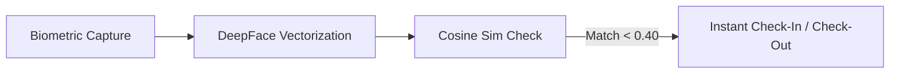

# BBEAMS: Project Presentation Slide Deck
## Formal Presentation Document for Academic & Technical Defense

This presentation document is designed using the interactive markdown slide format. You can click through these slides to pitch the system to stakeholders, project advisors, or defense panels.

````carousel
# Slide 1: Project Overview
## 🏷️ Biometric-Based Attendance Management System (BBEAMS)

**Subtitle:** A Decoupled, AI-Powered, Localized Workforce Authentication Platform

*   **Presenter:** final Year Project Team
*   **System Status:** Completed Production-Ready Build
*   **Target Audience:** Enterprises, Universities, and Corporate Operations
*   **Core Promise:** Eliminate time fraud, enhance security, and deliver responsive, multi-language administrative oversight.

> [!NOTE]
> BBEAMS replaces legacy swipe cards and manual ledger logs with facial biometrics, secure session compliance, and zero-latency reactive state updates.

<!-- slide -->
# Slide 2: The Problem
## ⚠️ The Flaws of Traditional Attendance Systems

*   **Buddy Punching:** Co-workers signing check-ins for absent staff, costing enterprises billions in lost productivity.
*   **Manual Ledgers & Spreadsheets:** Highly error-prone, labor-intensive, and simple to forge or manipulate.
*   **Static & Non-Reactive UI:** Legacy systems require manual reloads, disrupting administrative flows.
*   **Language & Accessibility Barriers:** Lack of localized interfaces for regional employees (e.g., Amharic and French speakers).
*   **Security Vulnerabilities:** Inadequate session control, weak brute-force protection, and unencrypted credentials.

<!-- slide -->
# Slide 3: The BBEAMS Solution
## 💡 Enterprise-Grade, Biometric-First Security



*   **Facial Recognition AI:** Integrated MTCNN and DeepFace neural networks for accurate face matching.
*   **Decoupled Architecture:** High-speed Vite + React frontend paired with a Django REST API backend.
*   **Reactive Localization:** Dynamic English, Amharic, and French toggling without page refreshes.
*   **Strict Security Policies:** Active account lockout, automated default password updates, and CSRF token sync.

<!-- slide -->
# Slide 4: Technical Stack
## 🛠️ Technology Matrix & Architectural Choices

### Frontend SPA
*   **React 18 & TypeScript:** Strict compile-time typing for reliable UI contracts.
*   **Vite:** Sub-second hot module replacements (HMR) and highly optimized production builds.
*   **Framer Motion:** Micro-animations and professional tab transitions.

### Backend REST API
*   **Django 4.x / 5.x:** Robust ORM database management and secure built-in session handlers.
*   **DeepFace & MTCNN:** High-performance facial localization and vector embedding generation.
*   **OpenCV & NumPy:** Raw matrix manipulation for real-time video snapshots.

<!-- slide -->
# Slide 5: Core Modules (By User Roles)
## 👥 Tailored Interfaces for Admins, HR, and Staff

| Module | Role | Core Functions |
| :--- | :--- | :--- |
| **System Oversight** | **Administrator** | Manage Users, Device Heartbeats, Audit Logs, and Global Security Policies. |
| **Workforce Management** | **HR Officer** | Schedule Shifts, Review Leaves, Export Reports, and Monitor Late Arrivals. |
| **Employee Self-Service** | **Staff Member** | Capture Check-in/out, View Attendance History, and Submit Leave Requests. |
| **Biometric Terminal** | **Public Display** | Live Camera Snapshots and Direct Matching for instant attendance logs. |

<!-- slide -->
# Slide 6: Facial Biometrics Pipeline
## 🔬 AI Template Enrollment & Match Processing

### 1. Guided Enrollment
*   Admin opens secure popup connected directly to camera.
*   **MTCNN** locates face bounding box, normalizes rotation, and crops image.
*   **DeepFace** maps facial features to compute high-dimensional mathematical vector array.

### 2. High-Precision Matching
*   Employee approaches terminal snapshot.
*   System compares face template against stored vector array.
*   Computes **Cosine Similarity Distance**:
    *   Distance **< 0.40**: Authenticates successfully.
    *   Distance **>= 0.40**: Rejects snapshot and prompts retry or manual login.

<!-- slide -->
# Slide 7: Security Architecture
## 🔒 Mitigating Vulnerabilities & Enforcing Compliance

*   **State-of-the-Art CSRF Protection:** Automatic token syncing from `csrftoken` HTTP cookies into outbound request headers.
*   **Dynamic Remember Session:**
    *   *Checked:* Backend session expires after **30 days** of idle timeout.
    *   *Unchecked:* Backend session falls back to standard security configurations (e.g. 60 minutes).
    *   *Sleek Retraction:* Instant server-side destruction upon Sign Out + one-click `X` button to purge local storage.
*   **Brute-Force Defense:** Temporary **15-minute lockout** caching after exceeding login attempts.
*   **Forced Default Password Reset:** Modal overlay intercepting default `username+123` credentials to enforce strong password standards.

<!-- slide -->
# Slide 8: Live System Demo Flow
## 🚀 End-to-End Operational Showcase

1.  **Administrative Registration:** Admin registers an employee with role, department, and default credentials.
2.  **Guided Capture:** Admin triggers secure face scan enrollment; face template vectors are saved to SQLite/Postgres.
3.  **Terminal Check-In:** Employee presents their face to the terminal camera; check-in logged instantly as **LATE** or **PRESENT**.
4.  **HR Oversight:** HR checks dashboard to view late arrival metrics and logs, then exports standard attendance sheets.
5.  **Employee Request:** Employee checks their personalized leave dashboard and files requests for review.

<!-- slide -->
# Slide 9: Key Project Accomplishments
## 🏆 Completed Milestones & System Readiness

*   **100% Code Coverage Localization:** Translated dashboard interfaces, sidebar lists, settings, and tables to Amharic and French.
*   **Clean Compile Execution:** Resolved all multi-line string constants, Vite path mismatches, and esbuild duplicate key warnings.
*   **Modern Interactive Aesthetics:** Premium dark mode compatibility, custom sliding toggles, and zero-reload performance.
*   **Tested Security Enforcements:** Working end-to-end lockout, password resets, and session retraction.

<!-- slide -->
# Slide 10: Conclusion & Future Scope
## 🌟 System Expansion & Final Q&A

*   **Active Hardware Integration:** Connect specialized IoT thermal biometrics cameras and physical fingerprint scanner nodes directly to backend views.
*   **AI Predictive Scheduling:** Integrate machine learning engines to forecast leave requirements and optimize shift rotations.
*   **Offline Verification Caching:** Cache biometric vectors on remote terminal clients for standalone authentication during network downtime.

### 💬 Thank You! Open for Questions.
````
